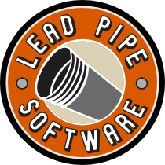

# LeadPipe.Net



LeadPipe.Net is an a'la carte toolbox for .NET programmers. The goal is to provide proven, well-tested, and well-documented libraries that programmers can rely on to help make their jobs a little easier. LeadPipe.Net doesn't try to force a particular application style or heavy-handed conventions. Instead, it takes a "take what you want and leave the rest" approach that provides solutions without a mess of tightly coupled dependencies.


## LeadPipe.Net

LeadPipe.Net is the core library that provides quite a few useful cross-cutting goodies that are handy for almost any project. Even if you don't want or need any other LeadPipe.Net libraries, there's almost certainly something in this library you'll find useful.

Head [over here](src/LeadPipe.Net/README.md) for more information!

## LeadPipe.Net.Domain

LeadPipe.Net.Domain provides implementations of core Domain Driven Design types including Entity, Repository, Value Object, domain events, Aggregate Roots, and more. These carefully crafted implementations are well documented and try to hold true to the spirit of Eric Evan's outstanding work.

Head [over here](src/LeadPipe.Net.Domain/README.md) for more information!

## LeadPipe.Net.Data.NHibernate

LeadPipe.Net.Data.NHibernate is a comprehensive pre-built data implementation package that uses NHibernate and provides implementations of a Repository, the Query Object pattern, and Unit of Work pattern. This library is built in such a way that if you don't want to abstract NHibernate's ISession object with a Unit of Work or use the Repository pattern, you can still take advantage of other offerings such as the Query Object pattern and Object Finder.

Head [over here](src/LeadPipe.Net.Data.NHibernate/README.md) for more information!

## LeadPipe.Net.Lucene

LeadPipe.Net.Lucene provides a set of base types that make implementing the powerful, open source Lucene search engine straight-foward. The goal is to make using Lucene as simple as this:

```c-sharp
var results = searchService.Search("123");
```

Head [over here](src/LeadPipe.Net.Lucene/README.md) for more information!

## LeadPipe.Net.Authorization

The LeadPipe.Net Authorization library provides a flexible, easy-to-use authorization mechanism for your applications. With it, your authorization looks like this:

```csharp
var isAuthorized = authorizer
	.Will.Assert
	.User(user)
	.Can.ExecuteAnyOfTheseActivities(new[] { activity })
	.In(application);
```

If you prefer exceptions:

```csharp
authorizer
	.Will.ThrowAccessDeniedException()
	.When.User(user)
	.Can.Not.ExecuteAnyOfTheseActivities(new[] { activity })
	.In(application);
```
Head [over here](src/LeadPipe.Net.Authorization/README.md) for more information!

## LeadPipe.Net.Validation

The validation library provides a suite of attributes that extend Microsoft's own System.ComponentModel.DataAnnotations library. In addition, there are handy extension methods and a stand-alone validator.

Head [over here](src/LeadPipe.Net.Validation/README.md) for more information!
